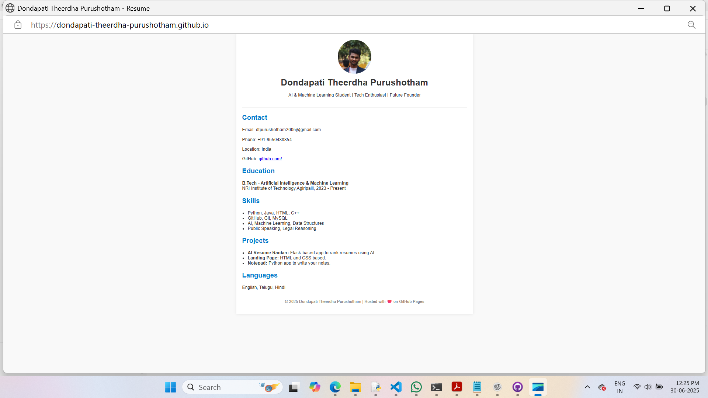

# Dondapati Theerdha Purushotham Resume Website

Welcome to my personal resume website! This project is a simple, static HTML/CSS portfolio hosted using **GitHub Pages**. It showcases my education, skills, projects, and contact details.

## 🌐 Live Website
   https://dondapati-theerdha-purushotham.github.io/

### SCREENSHOT

## 📄 Features

- Clean and responsive design
- Profile section with contact details
- Education and skills overview
- List of personal projects
- Hosted for free using GitHub Pages

## 🛠 Built With

- HTML5
- CSS3
- Git & GitHub
- GitHub Pages

## 🚀 How to Use

1. Clone this repository:
   git clone https://github.com/DONDAPATI-THEERDHA-PURUSHOTHAM
Open index.html in your browser to view locally.

Customize the HTML and CSS as needed.

Push changes to GitHub and the site will auto-update.

📧 Contact Me
Email: dtpurushotham2005@gmail.com

GitHub: https://github.com/DONDAPATI-THEERDHA-PURUSHOTHAM

© 2025 Dondapati Theerdha Purushotham | Powered by GitHub Pages
